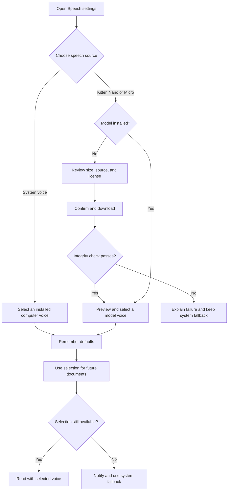

# Local TTS Model Settings - Plan

## Goal Capsule

- **Objective:** Let users opt into more natural, fully local speech without making a model download a prerequisite for using Planreader.
- **Product authority:** This contract defines model catalog scope, installation behavior, saved preferences, fallback behavior, and privacy expectations.
- **Open blockers:** None. The first supported neural runtime is macOS on Apple Silicon.

---

## Product Contract

### Summary

Planreader will add Speech settings where users can keep using their computer's voices or download one of two approved small local voice models. Installed model and voice preferences persist across documents, with automatic fallback to a system voice when the preferred model is unavailable.

### Problem Frame

The browser exposes an inconsistent set of system voices, and the available voices can sound robotic enough to undermine Planreader's audiobook-style experience. Sending narration to a cloud speech service would introduce another data recipient, while bundling a large neural model would make a small local utility cumbersome to install.

The product needs a middle path: optional, compact models that synthesize speech on the user's machine and remain easy to understand, remove, and recover from.

### Key Decisions

- **System speech remains available without setup.** It is the universal fallback and requires no model download.
- **The first catalog contains Kitten Nano and Kitten Micro.** (session-settled: user-directed — chosen over offering only one model: users should choose between the smallest download and potentially better quality.)
- **The catalog is curated.** (session-settled: user-directed — chosen over arbitrary Hugging Face model URLs: approved models allow predictable licensing, integrity checks, and support.)
- **Selections persist across documents.** (session-settled: user-directed — chosen over resetting to system speech at launch: the app should remember user defaults and fall back only when necessary.)
- **Initial downloads come from Hugging Face.** (session-settled: user-directed — chosen over requiring a company artifact mirror in the first release: direct downloads keep initial setup simpler.)
- **Generated audio is temporary.** It is removed when the Planreader session ends because it may contain company information.

### Requirements

**Speech choices and defaults**

- R1. Planreader must work with system speech when no local model is installed.
- R2. Speech settings must present Kitten Nano and Kitten Micro as the only downloadable models in the first release.
- R3. Each catalog entry must show its download size, installed state, available voices, source, license, and a plain-language quality or performance description.
- R4. Users must be able to preview an installed model's voices before choosing a default.
- R5. Planreader must remember the selected speech engine, model, voice, and reading speed across documents and launches.

**Installation and removal**

- R6. Planreader must ask for confirmation before downloading a model and show progress while the download is active.
- R7. Model downloads must use an immutable approved revision and pass an integrity check before becoming available.
- R8. Users must be able to remove an installed model and see how much space will be recovered.
- R9. Removing an active model must move the saved speech preference to an available system voice without preventing reading.
- R10. A failed, interrupted, incompatible, missing, or corrupt model must never leave Planreader unable to speak a document.

**Local playback and privacy**

- R11. Model inference must run on the user's computer and must not send narration text or generated audio to Hugging Face or another speech service.
- R12. Model acquisition may contact Hugging Face, but the download request must not contain document content.
- R13. Generated audio may be cached only for the active Planreader session and must be removed when that session exits.
- R14. Neural speech must preserve the existing playback controls and synchronized highlighting experience.

### Settings and Fallback Flow

### Key Flows

- F1. First optional model installation
  - **Trigger:** A user chooses an uninstalled catalog model.
  - **Steps:** Planreader presents size, source, and license; asks for confirmation; shows progress; verifies the result; then exposes its voices.
  - **Outcome:** The user can select an approved local voice or continue with system speech if setup fails.
  - **Covered by:** R2, R3, R6, R7, R10
- F2. Returning with a saved model
  - **Trigger:** Planreader starts after the user previously selected a local model and voice.
  - **Steps:** Planreader verifies that the model remains usable and restores the saved model, voice, and speed.
  - **Outcome:** Reading uses the remembered defaults without setup repetition.
  - **Covered by:** R5, R10
- F3. Missing or removed preferred model
  - **Trigger:** The saved model cannot be used or the user removes it.
  - **Steps:** Planreader selects an available system voice and gives a brief, non-blocking explanation.
  - **Outcome:** Reading remains available and the saved preference no longer points to the missing model.
  - **Covered by:** R8, R9, R10

### Acceptance Examples

- AE1. Optional setup
  - **Given:** A new user has downloaded no models.
  - **When:** They open and play a document.
  - **Then:** Planreader reads it with an available system voice without prompting for a model download.
  - **Covers:** R1, R10
- AE2. Confirmed model download
  - **Given:** Kitten Micro is not installed.
  - **When:** The user chooses it, reviews its details, and confirms the download.
  - **Then:** Planreader shows progress, verifies the pinned artifact, and enables its voices only after verification succeeds.
  - **Covers:** R3, R6, R7
- AE3. Remembered preference
  - **Given:** The user selected a Kitten Nano voice and a custom reading speed.
  - **When:** They launch Planreader with another document.
  - **Then:** The same model, voice, and speed are selected automatically.
  - **Covers:** R5
- AE4. Safe fallback
  - **Given:** The remembered local model was deleted outside Planreader.
  - **When:** The user opens a document.
  - **Then:** Planreader explains the fallback briefly and reads with an available system voice.
  - **Covers:** R9, R10
- AE5. Private synthesis
  - **Given:** A local model is installed and networking is unavailable.
  - **When:** The user listens to a generated briefing.
  - **Then:** Speech generation and playback continue locally, and session audio is removed when Planreader exits.
  - **Covers:** R11, R13

### Success Criteria

- Users can compare system speech, Kitten Nano, and Kitten Micro without understanding machine-learning terminology.
- Installing, selecting, and removing a local model never blocks access to system speech.
- No approved model package exceeds 60 MB, and settings report the actual size before download.
- Local neural speech works without a network connection after installation.
- Playback remains continuous enough for long-form listening and keeps synchronized highlighting.

### Scope Boundaries

- No arbitrary model URLs or user-supplied models.
- No large model packages such as full Kokoro.
- No cloud speech synthesis or voice cloning.
- No company-hosted artifact mirror in the first release.
- No permanent cache of generated narration audio.
- No requirement to support languages beyond English in the first release.

### Dependencies and Assumptions

- Approved Kitten Nano and Micro artifacts can be distributed under terms acceptable for company use.
- Planning will verify that the model artifacts, inference runtime, and supporting assets fit the stated size limits.
- The first supported neural environment is macOS on Apple Silicon. Other platforms continue to use system speech.

## Planning Contract

### Technical Decisions

- Use sherpa-onnx 1.13.4 through its Go API for local inference. It supports KittenTTS 0.8 and synthesizes float PCM entirely in process.
- Support `csukuangfj2/kitten-nano-en-v0_8-int8` pinned at revision `90dfe12687f7822a90e5afc5931b536ba6caf22a` and `csukuangfj2/kitten-micro-en-v0_8` pinned at `7131b31e5fbe7da21e32f84899d1d273a1477e15`.
- Download the small, explicit set of model files rather than accepting repository archives or user-controlled URLs. Validate each file against catalog size and SHA-256 metadata before atomically activating an installation.
- Store models and `preferences.json` under the user's application data directory. Write preferences and installs through temporary files followed by rename.
- Keep browser Web Speech as the default and fallback. Add token-protected same-origin JSON and audio endpoints for catalog, preferences, installation, removal, preview, and sentence synthesis.
- Generate neural audio one sentence at a time into the session temporary directory. Browser `Audio` playback drives the existing sentence highlighting and controls. Delete the entire session directory during shutdown.
- Serialize inference per process and cache initialized models in memory. The reader may request the next sentence while the current one plays to reduce gaps.
- Package sherpa's Apple Silicon dynamic libraries beside the executable for distribution. Development builds may use the module-provided libraries.

### Implementation Units

1. **Approved catalog and persistent preferences**
   - Add `model_catalog.go` with immutable model metadata, display copy, eight voice names, required files, and supported-platform information.
   - Add `model_store.go` to resolve application storage, validate installations, save speech engine/model/voice/speed, and repair invalid saved selections to system speech.
   - Cover catalog invariants, atomic preference writes, missing-model fallback, and removal.

2. **Safe model installation**
   - Add an HTTP downloader with timeouts, bounded response sizes, pinned Hugging Face URLs, progress state, cancellation, per-file SHA-256 verification, staging directories, and atomic activation.
   - Never place document content in model requests. Refuse redirects away from `huggingface.co` or `cdn-lfs.huggingface.co`.
   - Cover interrupted, oversized, corrupt, and successful installs with local test servers.

3. **Local synthesis and session audio**
   - Add a small synthesizer interface in `tts.go`, a sherpa implementation for `darwin/arm64`, and an unavailable implementation elsewhere.
   - Encode generated mono float samples as WAV, constrain input and rate, and write only to a newly-created session directory.
   - Clean the session directory on shutdown and cover WAV encoding, validation, concurrency, and cleanup with tests. Keep real-model synthesis as an opt-in integration test.

4. **Private reader API**
   - Extend `server.go` with token-scoped method-specific endpoints for status, preferences, install, remove, preview, synthesis, and session audio.
   - Add request/body limits, safe model/voice lookup, same-origin protection for mutations, no-store headers, and a CSP that permits same-origin audio.
   - Cover every route with fakes, including error and fallback responses.

5. **Speech settings and playback**
   - Add a plain-language Speech settings panel showing system speech plus both approved downloads, their honest sizes, license/source, installed state, progress, removal, voice selection, and preview.
   - Persist system voice URI and speed too. When a neural choice becomes unavailable, show one non-blocking fallback notice and continue with system speech.
   - Refactor `web/reader.js` around system and neural playback adapters so play, pause, stop, previous, next, clicking a sentence, rate, and highlighting behave consistently.

6. **Packaging and user guidance**
   - Document Apple Silicon neural support, the optional 42 MB and 59 MB model downloads, the one-time native runtime footprint, privacy boundaries, fallback behavior, and removal location.
   - Add a packaging script that builds the binary and copies/relinks the three required sherpa libraries into a distributable directory.

### Verification Contract

- `go test ./...` and `go vet ./...` pass without an installed model or network access.
- Browser tests confirm system speech remains immediately usable, settings persist, both catalog entries explain their downloads, install errors remain recoverable, and neural `Audio` playback advances highlighting.
- On Apple Silicon, an opt-in smoke test installs Nano, generates a preview while offline, verifies a playable WAV, restarts the app to prove preference restoration, removes the model, and confirms system fallback.
- A network observer or request test confirms document text is sent only to the selected narration provider and never appears in model-download requests.

### Definition of Done

- All R1-R14 and AE1-AE5 are represented by automated tests or the documented Apple Silicon smoke test.
- The settings interface uses non-technical language and does not imply Micro is below 50 MB.
- Corrupt or absent assets cannot be selected, and no failed local operation prevents system speech.
- Session audio is removed on normal shutdown and startup removes stale session directories from interrupted prior runs.
- The repository contains reproducible build/package instructions and pinned dependency/model revisions.

### Sources and Research

- [KittenTTS](https://github.com/KittenML/KittenTTS) documents Apache 2.0 licensing, CPU operation, eight voices, and model variants from approximately 25 MB to 80 MB.
- [Sherpa-ONNX KittenTTS documentation](https://k2-fsa.github.io/sherpa/onnx/tts/pretrained_models/kitten.html) documents offline KittenTTS support and a Go integration example.
