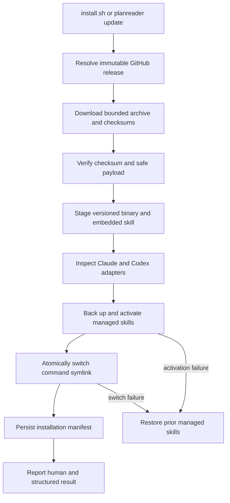

# Guided Installation and Updates - Plan

## Goal Capsule

- **Objective:** Let an Apple-silicon Mac user ask Claude or Codex to install and update Planreader without cloning the repository or understanding Go, shell paths, or skill directories.
- **Product authority:** This contract defines the supported installation journey, agent integration, update behavior, user-scope defaults, and source-build fallback.
- **Open blockers:** None. The implementation uses GitHub Releases, current user-scoped Claude and Codex skill locations, and a release workflow that can sign and notarize artifacts when credentials are configured.
- **Execution profile:** Code change with test-first coverage for filesystem transactions, release downloads, skill parity, and CLI behavior.
- **Tail ownership:** The shipping workflow owns review, release-workflow validation, documentation, commit, pull request, and CI follow-through.

---

## Product Contract

### Summary

Planreader will provide one supported installation flow that works when invoked by Claude, Codex, or a person. A small bootstrap obtains the current Planreader release, after which Planreader installs its matching skills and owns future updates.

### Problem Frame

The current build instructions assume users have cloned the repository and installed Go. They also leave the Planreader skill inside the repository, requiring users or agents to understand where skills belong and how to keep them compatible with the executable.

Installation should instead feel like a product capability. Users should be able to ask their existing agent to install or update Planreader and receive a working, verified result without learning the underlying tooling.

### Key Decisions

- **The normal installation does not clone the repository.** (session-settled: user-approved — chosen over making a repository checkout the primary entry point: non-developers should not need Git or Go.)
- **A bootstrap hands ownership to Planreader.** (session-settled: user-approved — chosen over agent-specific file manipulation alone: humans, Claude, and Codex should share one testable installation path.)
- **The first release supports Apple-silicon macOS.** (session-settled: user-directed — chosen over launching across macOS, Linux, and Windows: the first release should stay narrow.)
- **Installation is scoped to the current user.** (session-settled: user-approved — chosen over a system-wide installation: setup should not require administrator access.)
- **Detected Claude and Codex installations both receive the skill.** (session-settled: user-approved — chosen over configuring only the invoking agent: either agent should be ready after one installation.)
- **Planreader may update the user's shell path configuration.** (session-settled: user-approved — chosen over requiring manual shell setup: the installed command should work immediately in future terminals.)
- **Updates are visible and user-initiated.** (session-settled: user-approved — chosen over silent background replacement: Planreader may notify, but the user decides when software changes.)

### Actors

- **User:** Wants Planreader available without learning installation mechanics.
- **Claude or Codex:** Reads the public installation guidance, invokes the supported flow, and reports the result.
- **Planreader installer:** Obtains and verifies the application, configures the command and detected agent integrations, and preserves user settings during updates.
- **Release service:** Publishes the current compatible application, skill payload, version information, and integrity metadata.

### Requirements

**Initial installation**

- R1. A user must be able to initiate installation by giving Claude or Codex a public Planreader repository or installation reference.
- R2. The normal installation must not require a repository clone, Go toolchain, or administrator permission.
- R3. The first release must reject unsupported operating systems or architectures with a clear explanation instead of attempting a partial installation.
- R4. Installation must obtain the latest compatible Apple-silicon macOS release and verify its authenticity or integrity before activation.
- R5. Planreader must install for the current user in a location that remains available across terminal sessions.
- R6. When the command location is not already reachable, installation must safely add it to the user's supported shell path configuration and explain the change.

**Agent integration**

- R7. The installed Planreader release must carry or identify a compatible version of the Planreader skill.
- R8. Installation must configure the skill for every detected supported Claude and Codex installation.
- R9. A missing agent, unknown skill location, or failed integration must not undo an otherwise usable Planreader installation.
- R10. Installation must report which agent integrations were installed, updated, skipped, or need attention.

**Updates and recovery**

- R11. Running the installation flow again must safely converge an existing installation on the latest compatible release.
- R12. `planreader update` must update the application and its installed skills together while preserving application settings.
- R13. `planreader update --check` must report update availability without changing the installation.
- R14. Planreader must periodically check for newer compatible releases and present a quiet, non-blocking notice when one is available.
- R15. Planreader must not replace itself or its skills until the user explicitly initiates the update.
- R16. An interrupted or failed update must leave the prior working installation available whenever it existed before the update.
- R17. Installation and update commands must finish with a plain-language summary of the active version, configured agents, path status, and any recovery action.

**Developer fallback**

- R18. Public guidance must document a source-build fallback for cases where a compatible release cannot be used.
- R19. An agent performing the fallback must use a temporary checkout and the repository's vendored build process rather than requiring the user to manage a permanent clone.
- R20. A source-built installation must identify itself so later updates can explain whether they will rebuild it or replace it with an official release.

**Agent-readable operation**

- R21. Install, update, update-check, version, and integration-status operations must offer stable machine-readable results alongside their human summaries.
- R22. The installed skill must invoke the installed Planreader executable from any working directory instead of locating this repository or running Go.
- R23. Planreader must expose integration status and repair behavior so an agent can report version, destination, compatibility, and recovery without inferring filesystem state.
- R24. Planreader must refuse to overwrite a same-named skill it does not manage and must explain how the user can resolve the collision.

### Key Flows

- F1. Conversational first installation
  - **Trigger:** A user asks Claude or Codex to install Planreader and supplies its public reference.
  - **Actors:** User, Claude or Codex, installer, release service.
  - **Steps:** The agent follows the authoritative guidance; the bootstrap verifies and activates Planreader; Planreader configures the command and every detected agent skill; the agent reports the result.
  - **Outcome:** The user can invoke Planreader from a new terminal and request Planreader tasks from either configured agent.
  - **Covered by:** R1-R10, R17

- F2. User-approved update
  - **Trigger:** The user acts on an update notice or asks an agent to update Planreader.
  - **Actors:** User, Claude or Codex, installer, release service.
  - **Steps:** Planreader checks compatibility; downloads and verifies the new release; stages the application and matching skills; activates them as one update; confirms preserved settings.
  - **Outcome:** The application and installed skills are compatible and current, or the previous installation remains usable.
  - **Covered by:** R11-R17

- F3. Source-build fallback
  - **Trigger:** No compatible release can be used or the user explicitly requests a source build.
  - **Actors:** User, Claude or Codex, installer.
  - **Steps:** The agent explains the fallback; uses a temporary checkout and vendored dependencies; builds and installs Planreader; records the installation origin; removes temporary build material when safe.
  - **Outcome:** Planreader is installed without requiring the user to maintain a repository checkout.
  - **Covered by:** R18-R20

### Acceptance Examples

- AE1. Clean Apple-silicon Mac
  - **Given:** The user has a signed-in Claude or Codex installation but no Planreader checkout or Go toolchain.
  - **When:** The user asks the agent to install Planreader from its public reference.
  - **Then:** The latest verified release is installed for that user, detected agent skills are configured, and the `planreader` command works in a new terminal.
  - **Covers:** R1-R10, R17

- AE2. Both agents detected
  - **Given:** Claude and Codex are both installed in supported configurations.
  - **When:** Planreader installation completes through either agent.
  - **Then:** Both receive the matching skill and the summary names both successful integrations.
  - **Covers:** R7-R10

- AE3. One agent integration fails
  - **Given:** Planreader can install but one detected agent has an unsupported or unwritable skill location.
  - **When:** Installation configures integrations.
  - **Then:** Planreader and successful integrations remain active, while the summary identifies the incomplete integration and a recovery action.
  - **Covers:** R9-R10, R17

- AE4. Update succeeds
  - **Given:** Planreader and its skills are one release behind and the user has saved speech settings.
  - **When:** The user runs `planreader update` or asks an agent to update it.
  - **Then:** The current compatible application and skills become active together and the saved settings remain unchanged.
  - **Covers:** R11-R12, R17

- AE5. Update is interrupted
  - **Given:** A working installation exists.
  - **When:** Download, verification, or activation fails during an update.
  - **Then:** The previous application and skills remain available and the user receives a recoverable error.
  - **Covers:** R16-R17

- AE6. Unsupported computer
  - **Given:** The installation flow runs on a non-Apple-silicon Mac or another operating system.
  - **When:** Compatibility is checked.
  - **Then:** No partial installation is activated and the user sees the supported platform plus source-build guidance when applicable.
  - **Covers:** R3, R18

### Success Criteria

- A new Apple-silicon Mac user can move from a conversational install request to a working command and agent skill without Git, Go, or administrator access.
- Repeating installation or requesting an update never requires the user to find binary or skill directories manually.
- The installed application and skills cannot silently drift to incompatible release versions through the supported flow.
- Failures leave users with either the previous working installation or a precise recovery action.

### Scope Boundaries

- Linux, Windows, and Intel Mac release installation are deferred.
- Fully automatic background updates are outside the first release.
- A graphical installer and package-manager distribution are deferred.
- System-wide installation and multi-user machine administration are outside the first release.
- Installing or authenticating Claude or Codex themselves remains the user's responsibility.
- Automatic source builds are a fallback, not the normal installation experience.

### Dependencies and Assumptions

- GitHub or another public release service can expose a stable latest-release reference, integrity metadata, and Apple-silicon macOS artifacts.
- Claude and Codex provide supported user-scoped skill installation locations that can be detected without weakening permissions.
- Supported Mac shells have a safe user-owned configuration point for adding the Planreader command location.
- Release planning will define signing, integrity verification, rollback activation, version compatibility, and update-check frequency.
- Claude user skills are installed under `~/.claude/skills`; Codex user skills are installed under `$CODEX_HOME/skills` when set and `~/.codex/skills` otherwise.

---

## Planning Contract

**Product Contract preservation:** Changed R21-R24 to make the already-approved conversational installation and update behavior testable through stable agent-readable results, repository-independent skills, integration repair, and collision safety.

### Key Technical Decisions

- KTD1. **Use the CLI as the shared human and agent installation API.** Cobra subcommands provide install, update, version, and integration status/repair while the existing `planreader DOCUMENT.md` behavior remains compatible.
- KTD2. **Keep release payloads version-locked.** The executable embeds the complete `read-with-planreader` skill and build metadata, so one release is the authority for binary and skill compatibility.
- KTD3. **Use a versioned current-user layout.** Release contents live in the Planreader application-support directory, while `~/.local/bin/planreader` is an atomically replaced symlink to the active version; application preferences and voice models remain outside version directories.
- KTD4. **Treat multi-destination activation as a recoverable transaction.** Stage and verify every artifact, back up managed skill directories, activate skills, switch the executable last, and restore prior managed state when a required activation step fails. An unavailable optional agent integration produces a usable-with-attention result under R9 rather than rolling back the application.
- KTD5. **Own shell edits with a marked block.** On Apple-silicon macOS, add an idempotent Planreader-owned `~/.local/bin` block to the zsh login profile without rewriting unrelated content. Report the exact file and use the executable's absolute path during the current agent session.
- KTD6. **Centralize agent adapters.** Claude targets `~/.claude/skills/read-with-planreader`; Codex targets `$CODEX_HOME/skills/read-with-planreader` or `~/.codex/skills/read-with-planreader`. Each adapter distinguishes absent, writable, managed, and unmanaged-collision states.
- KTD7. **Use GitHub Releases as the first release service.** Resolve one immutable version, download a bounded Apple-silicon archive and checksum manifest over HTTPS, verify SHA-256 before extraction, and reject path traversal or unexpected payloads. Release automation signs with Developer ID and notarizes the distribution archive when repository secrets are available.
- KTD8. **Make source-build replacement explicit.** Builds without release metadata report `dev` and `source`; update checks explain that state, and replacement with an official binary requires an explicit `--replace-source` choice.
- KTD9. **Check quietly and never update implicitly.** Cache the last successful release check for 24 hours, use a short timeout, suppress network failures during reader startup, and print only an available-version notice.
- KTD10. **Refuse unmanaged skill collisions.** A Planreader manifest marks owned skill directories. Repair and update may replace only managed copies; unrelated same-named skills remain untouched until the user resolves the conflict.

### High-Level Technical Design

The `internal/install` package owns paths, manifests, agent adapters, shell configuration, transactions, and status/repair. The `internal/release` package owns version metadata, GitHub release resolution, download validation, checksums, safe archive extraction, update-check caching, and update orchestration. Both expose dependency-injected services so tests use temporary homes and local HTTP servers.

The application embeds `skills/read-with-planreader` through a small payload package. Release builds inject version, commit, and origin values. Human output remains concise, while a shared result schema supports `--json` on non-reader subcommands.

### Sequencing

1. Establish version metadata, embedded skill payload, and CLI subcommand seams.
2. Implement installation state, agent adapters, shell ownership, and repair before network updates.
3. Implement release resolution and transactional self-update against the installed layout.
4. Add the bootstrap and GitHub release workflow once the binary contract is stable.
5. Update the installed skill and public documentation, then verify the full flow from outside the repository.

### System-Wide Impact and Risks

- The existing skill's repository discovery and `go run -mod=vendor` behavior is incompatible with release installation and must change in the same release.
- A shell profile edit cannot change the parent agent's environment. Installation output must provide the absolute executable path and explain that new sessions will resolve `planreader` normally.
- Updating a running executable is safe only through the versioned layout and final symlink switch. Direct in-place replacement is prohibited.
- GitHub-hosted checksums protect against corruption but share the release account's trust boundary. Developer ID signing, notarization, immutable releases, and CI provenance strengthen authenticity.
- Skill conventions can change independently of Planreader. Agent-specific path and detection logic stays behind adapters with focused tests and status reporting.
- Active Claude or Codex sessions may retain an old loaded skill after on-disk replacement. Update output must request a new session or skill reload rather than claiming the current session changed.

### Sources and Research

- `cmd/root.go` provides the existing Cobra command and injected output seam that subcommands must preserve.
- `internal/speech/model_download.go` provides local patterns for bounded HTTPS downloads, redirect allowlists, SHA-256 verification, staging, and activation.
- `internal/speech/model_store.go` establishes the Planreader user-configuration root and atomic JSON persistence; installation metadata must not disturb `preferences.json` or `models/`.
- `skills/read-with-planreader/SKILL.md` is the payload to migrate from repository execution to the installed command.
- Apple recommends Developer ID signing and notarization for directly distributed Mac software, using `notarytool` for automated custom workflows.
- GitHub supports immutable releases and release-asset integrity verification; the first release workflow should publish immutable versioned assets and checksums.

---

## Implementation Units

### U1. Versioned CLI and embedded skill contract

- **Goal:** Add build identity, embed the complete skill payload, and introduce install-oriented Cobra subcommands without breaking document reading.
- **Requirements:** R7, R17, R20-R23
- **Files:** `cmd/root.go`, `cmd/root_test.go`, `cmd/version.go`, `cmd/version_test.go`, `internal/buildinfo/buildinfo.go`, `internal/payload/payload.go`, `internal/payload/payload_test.go`, `skills/read-with-planreader/SKILL.md`, `skills/read-with-planreader/agents/openai.yaml`
- **Approach:** Split reader argument validation from the root so `install`, `update`, `version`, and `integrations` subcommands can coexist with the positional document path. Embed skill files and expose release identity with source-build defaults. Add `--json` result rendering for operational commands.
- **Test scenarios:** Existing document/help behavior remains compatible; release and source identities render correctly; embedded skill contains both required files; JSON and human output are stable; installed skill invokes `planreader` rather than Go or repository discovery.
- **Verification:** `go test -mod=vendor ./cmd ./internal/buildinfo ./internal/payload`

### U2. Current-user installation and agent integration state

- **Goal:** Install and repair the local application layout, shell path, and managed Claude/Codex skills idempotently.
- **Requirements:** R2-R3, R5-R10, R17, R21-R24
- **Files:** `internal/install/paths.go`, `internal/install/manifest.go`, `internal/install/agents.go`, `internal/install/shell.go`, `internal/install/service.go`, `internal/install/install_test.go`, `cmd/install.go`, `cmd/integrations.go`
- **Approach:** Use injected home, config, platform, lookup, and filesystem seams. Store managed versions under application support, atomically switch the command symlink, write an ownership manifest into managed skill directories, refuse unmanaged collisions, and append one marked zsh path block. Expose status and repair through the same service.
- **Test scenarios:** Clean Claude-only, Codex-only, both-agent, and no-agent installs; unsupported platform; `$CODEX_HOME`; idempotent rerun; exact marked shell edit; unmanaged collision; one unwritable integration; current-session absolute path; status and repair output; preservation of speech settings and models.
- **Verification:** `go test -mod=vendor ./internal/install ./cmd`

### U3. Verified release client and update transaction

- **Goal:** Check for and activate compatible releases without losing the previous working installation.
- **Requirements:** R4, R11-R17, R20-R21, R23-R24
- **Files:** `internal/release/client.go`, `internal/release/archive.go`, `internal/release/cache.go`, `internal/release/updater.go`, `internal/release/release_test.go`, `cmd/update.go`, `cmd/root.go`
- **Approach:** Resolve a pinned GitHub release version, enforce HTTPS/host/redirect/size boundaries, verify the checksum manifest, validate archive paths, serialize updates with a lock, stage the release, and delegate activation to the installation transaction. Cache checks for 24 hours and make startup failures silent.
- **Test scenarios:** Newer/equal/older and malformed versions; mutable-latest race prevention; checksum mismatch; unsafe archive entry; redirect or size rejection; `--check`; source build refusal and `--replace-source`; interrupted skill activation rollback; symlink switch failure; concurrent update lock; quiet cached startup notice.
- **Verification:** `go test -mod=vendor ./internal/release ./internal/install ./cmd`

### U4. Bootstrap and release automation

- **Goal:** Publish a verifiable Apple-silicon package and provide a minimal bootstrap that hands control to Planreader.
- **Requirements:** R1-R5, R11, R17-R19
- **Files:** `install.sh`, `scripts/package-release.sh`, `scripts/test-install.sh`, `.github/workflows/release.yml`, `.github/workflows/ci.yml`
- **Approach:** Package the binary, required sherpa dynamic libraries, and checksum metadata into a versioned archive. Build with vendored dependencies and injected metadata. Gate bootstrap on `Darwin/arm64`, download one pinned release and checksum, verify, extract safely, and invoke the staged binary's install command. Sign and notarize when release credentials are configured, with validation that unsigned publication cannot be mistaken for notarized output.
- **Test scenarios:** Fixture release install without repository or Go; unsupported platform; checksum failure; missing asset; repeated bootstrap update; packaged binary version and dynamic-library smoke; workflow syntax and package validation.
- **Verification:** `sh scripts/test-install.sh`; `go build -mod=vendor ./...`; package smoke on Apple silicon.

### U5. Skill parity and public installation guidance

- **Goal:** Make conversational installation, reading, updating, status, and repair work identically through Claude and Codex.
- **Requirements:** R1, R7-R10, R17-R24
- **Files:** `skills/read-with-planreader/SKILL.md`, `skills/read-with-planreader/agents/openai.yaml`, `INSTALL.md`, `README.md`, `internal/payload/payload_test.go`
- **Approach:** Rewrite the skill around the installed executable and provider-specific invocation. Add authoritative agent-readable installation guidance, a human bootstrap command, update/status/repair examples, source-build fallback using vendored dependencies, approval boundaries, and same-session path/reload expectations.
- **Test scenarios:** Installed skill works from a non-repository directory for Claude and Codex; provider failures do not switch providers; install/update instructions never bypass approvals; both agent payloads match the release version; source fallback uses a temporary checkout and vendored build.
- **Verification:** Payload assertions plus a fixture skill invocation smoke for each provider.

### U6. End-to-end recovery and compatibility verification

- **Goal:** Prove the supported journey and failure guarantees across all units.
- **Requirements:** R1-R24; F1-F3; AE1-AE6
- **Files:** `internal/install/integration_test.go`, `internal/release/integration_test.go`, `scripts/test-install.sh`
- **Approach:** Compose temporary-home integration fixtures and local release servers. Exercise install, update, collision, partial integration, rollback, repair, shell refresh, and settings preservation without touching the developer's real home or network.
- **Test scenarios:** Every acceptance example; stale binary/current skill; current binary/stale skill; interrupted second-agent activation; rerun convergence; active-session reload notice; clean update from a non-Planreader directory.
- **Verification:** `go test -mod=vendor ./...`; `go vet -mod=vendor ./...`; `go build -mod=vendor ./...`; `sh scripts/test-install.sh`

---

## Verification Contract

| Gate | Command | Proves |
|---|---|---|
| Unit and integration tests | `go test -mod=vendor ./...` | CLI compatibility, downloads, transactions, agent adapters, status, repair, and recovery |
| Static analysis | `go vet -mod=vendor ./...` | Go correctness across platform-specific files |
| Vendored build | `go build -mod=vendor ./...` | Reproducible repository build without dependency downloads |
| Bootstrap fixture | `sh scripts/test-install.sh` | No-clone installation, verification, idempotency, and update behavior |
| Release package smoke | `scripts/package-release.sh` followed by staged `planreader version` | Release metadata, bundled skill, binary layout, and required libraries |
| Agent parity smoke | Run the installed skill from a temporary non-repository directory with fake Claude and Codex commands | Provider selection and repository independence |

Network-independent tests must use local HTTP fixtures. Release publication requires a tagged Apple-silicon package whose checksum, signature, notarization state, embedded version, and packaged dynamic libraries pass validation.

---

## Definition of Done

- U1-U6 are complete with their named tests and requirement traceability.
- All Product Contract requirements and acceptance examples are covered by automated tests or an explicit release smoke check.
- A clean Apple-silicon Mac can install from the public entry point without Git, Go, or administrator access.
- Claude and Codex can both invoke the installed skill from outside the repository and receive stable status/update results.
- An interrupted update retains or restores the previous working executable and managed skills.
- The release workflow produces versioned, verified artifacts and handles signing/notarization credentials without exposing secrets.
- README and INSTALL guidance match the actual commands, destinations, approvals, and reload behavior.
- The vendored test, vet, build, bootstrap, package, and agent-parity gates pass.
- Experimental or abandoned installer/update code is removed from the final diff.
