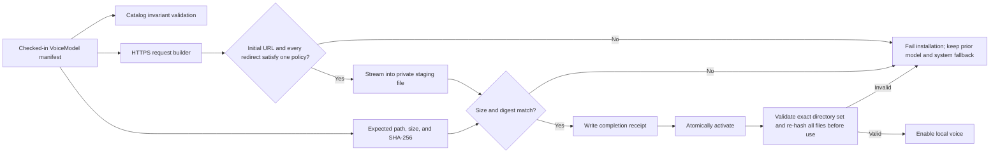

# Model Download Supply-Chain Hardening - Plan

## Goal Capsule

- **Objective:** Make every voice-model installation fail closed unless the complete, explicitly approved payload arrives over validated HTTPS and matches integrity metadata controlled by Planreader.
- **Product authority:** This plan preserves the curated Kokoro catalog, direct Hugging Face delivery, local inference, existing settings experience, and system-speech fallback established by `docs/plans/2026-07-22-001-feat-local-tts-model-settings-plan.md`.
- **Open blockers:** None. Exact file digests and first-admission provenance must be audited for the currently pinned model revisions before the catalog change is merged.
- **Stop condition:** Stop and reassess if an approved file cannot be assigned a stable SHA-256 digest, if the pinned revision no longer resolves to the reviewed payload, if first-admission provenance cannot be tied to the official sherpa-onnx release lineage, or if sherpa-onnx requires assets that cannot be explicitly enumerated.

---

## Product Contract

### Summary

Planreader will keep downloading its two curated Kokoro voice packs directly from Hugging Face, but will stop treating Hugging Face’s live repository metadata as the integrity authority. Each release of Planreader will carry the complete approved file manifest. A model becomes usable only when every downloaded and installed file matches that manifest.

### Problem Frame

The current downloader has strong bounds, staging, and commit pinning, but two trust gaps remain. Redirect handling checks only the destination hostname, allowing a redirect to use HTTP or an unexpected port. File hashes are learned from the same Hugging Face response path that serves the payload and are optional for non-LFS entries, so they do not provide an independent trust anchor.

Installation also accepts a prefix-based family of English language files while later installed-state verification checks only the fixed required-file list. That creates a difference between what Planreader downloads and what it subsequently proves unchanged.

### Key Decisions

- **Continue direct Hugging Face delivery.** (session-settled: user-approved — chosen over a Planreader-operated model mirror: the checked-in manifest can provide independent integrity without adding artifact-hosting operations.)
- **Make Planreader’s source-controlled manifest authoritative.** Repository APIs may help maintainers audit an update, but runtime installation must not derive approved paths, sizes, or hashes from live metadata.
- **Enumerate every approved file.** Prefix and wildcard admission are removed so the downloaded payload and the subsequently verified payload are identical sets.
- **Fail closed on incomplete provenance.** A model catalog entry without a valid full revision, positive bounded sizes, and lowercase SHA-256 digests for every file is a build/test failure and cannot install at runtime.
- **Preserve recovery behavior.** A failed integrity or transport check leaves the previous complete installation intact when one exists and always leaves system speech available.

### Requirements

- R1. Every initial model request and redirect hop must use HTTPS, port 443 or the implicit HTTPS port, no URL credentials, and an explicitly approved Hugging Face hostname.
- R2. Redirect processing must stop after a bounded number of hops and reject any scheme downgrade, alternate port, credential-bearing URL, IP literal, or unapproved hostname before issuing the next request.
- R3. Each approved model must declare a full immutable repository revision and an exact manifest of relative file paths, positive sizes, and lowercase SHA-256 digests in Planreader source.
- R4. Runtime installation must download only the files in that checked-in manifest and must not use a live repository listing to expand or change the approved payload.
- R5. Every file must match both its checked-in size and SHA-256 digest before activation; missing, duplicate, unexpected, malformed, or mismatched metadata must fail the installation.
- R6. Installed-state validation must reject symlinks, non-regular files, missing files, unexpected files, manifest drift, size changes, and digest changes across the entire approved payload.
- R7. Staging, private file permissions, total-size bounds, cancellation, serialized installation, and system-speech fallback must remain intact, while activation must retain or restore the prior complete installation if replacement fails.
- R8. Maintainers must have a documented, reviewable process for updating a model revision and its manifest without silently trusting mutable branches or runtime API metadata.

### Acceptance Examples

- AE1. HTTPS downgrade rejection
  - **Given:** An approved download endpoint returns a redirect to `http://huggingface.co/...`.
  - **When:** Planreader evaluates the redirect.
  - **Then:** It rejects the redirect before sending the downgraded request and leaves the active speech configuration usable.
  - **Covers:** R1, R2, R7
- AE2. Independent digest rejection
  - **Given:** Hugging Face returns the expected file size but different bytes from the checked-in digest.
  - **When:** Planreader downloads the file.
  - **Then:** Installation fails before activation even if live repository metadata describes the altered bytes.
  - **Covers:** R3, R4, R5
- AE3. Exact payload installation
  - **Given:** Every explicitly approved file arrives with the expected size and digest.
  - **When:** Installation completes.
  - **Then:** Planreader atomically activates the model and records a completion manifest that matches the catalog.
  - **Covers:** R3-R7
- AE4. Post-install tampering
  - **Given:** An installed auxiliary language file is changed, replaced by a symlink, removed, or an unexpected file is added.
  - **When:** Planreader validates the installation before use.
  - **Then:** It treats the model as unavailable and falls back to system speech.
  - **Covers:** R6, R7
- AE5. Reviewed model update
  - **Given:** A maintainer wants to move an approved model to a new revision.
  - **When:** They follow the provenance update process.
  - **Then:** The change includes the full revision, explicit manifest delta, independently reviewed sizes and digests, source/license confirmation, and automated catalog validation.
  - **Covers:** R3, R8

### Scope Boundaries

- No Planreader-hosted model mirror or proxy.
- No arbitrary model repositories, URLs, files, or user-supplied manifests.
- No change to the two supported Kokoro catalog entries, voice names, inference runtime, model format, or settings interface.
- No requirement for model signing infrastructure in this change; the source-controlled manifest is the independent trust anchor.
- No reliance on Hugging Face malware badges as a runtime authorization signal. They remain useful upstream defense in depth.

---

## Planning Contract

### Key Technical Decisions

- KTD1. **Replace runtime repository discovery with a typed approved-file manifest.** Add a private file descriptor to each `VoiceModel` containing path, exact byte count, and SHA-256. Derive display size and installation totals from these descriptors so user-visible size, limits, and verification cannot drift. Governs R3-R5.
- KTD2. **Use one URL policy for initial requests and every redirect.** Keep the approved Hugging Face host family, but validate scheme, credentials, port, hostname, and hop count before a redirected request is issued. The request builder remains responsible for constructing paths from catalog-controlled repository, revision, and file values. Governs R1, R2.
- KTD3. **Compare downloads directly with catalog digests.** Streaming writes retain the current per-file byte bound and private staging behavior, but success requires both the exact catalog size and digest. Live LFS/Xet metadata is not an authorization input. Governs R3-R5, R7.
- KTD4. **Make the completion marker a receipt, not the trust source.** The installed `.complete` file records the catalog revision and the exact expected file metadata. Validation first proves that receipt matches the current catalog, then uses `Lstat` and streaming hashes to prove every approved file is a regular file with matching content. Governs R6.
- KTD5. **Reject payload-set drift in both directions.** Installation has no wildcard admission. Installed-state validation walks the model directory and permits only catalog files, their required parent directories, and `.complete`; an additional regular file, link, or special node invalidates the model. Governs R4-R6.
- KTD6. **Treat manifest updates as security review work.** Document how to select a full commit, enumerate required sherpa-onnx assets, record hashes and sizes, compare source/license provenance, inspect the manifest diff, and run an opt-in real-download verification. Any helper may print candidate metadata but must not automatically bless or rewrite the catalog. Governs R8.
- KTD7. **Follow the release downloader's injected-client pattern.** Keep production URL policy fixed while allowing tests to supply a client or transport that returns controlled redirect and payload responses without weakening the production host allowlist. Governs R1, R2, R5.
- KTD8. **Make activation recoverable.** Replace the current remove-then-rename sequence with a same-filesystem transaction that retains the prior complete installation until the verified stage is active, restores it on an activation error, and repairs or removes transaction leftovers on the next install attempt. Governs R7.
- KTD9. **Let the speech service own a process-local verification generation.** Perform a full catalog-backed verification on first use of a model in each Planreader process. Cache success by model ID, catalog revision, and an in-memory installation generation; invalidate it synchronously after install activation, rollback restoration, or removal, before those operations return. Per-sentence synthesis requests may reuse only the current generation, while catalog polling remains metadata-only. A restarted process always re-verifies. Governs R6, R7.

### Threat Model

- **In scope:** A compromised or inconsistent upstream repository/API response, malicious redirects, network tampering defeated by TLS and digest checks, truncated or oversized responses, unsafe catalog metadata introduced in review, corrupt or altered on-disk model files between sessions, and interrupted activation.
- **Out of scope:** An attacker already able to execute as the same local user while Planreader is running. Such an attacker can race ordinary filesystem checks and modify the Planreader executable or catalog itself. The implementation still rejects links and special files at stable validation points, but it does not claim descriptor-relative race resistance against an active same-user adversary.
- **Security invariant:** Network and receipt metadata may describe bytes but cannot authorize them; only the reviewed catalog compiled into Planreader can authorize an installed payload. This guarantees integrity after catalog admission. First-admission authenticity remains a separate provenance review anchored in the official sherpa-onnx release lineage.

### High-Level Technical Design

The following is directional design guidance rather than implementation specification.

The trust boundary is intentionally one-way: network responses provide bytes, while the checked-in Planreader catalog decides which bytes are acceptable. The completion receipt accelerates comparison and records provenance but cannot broaden the catalog.

### Assumptions

- The current pinned Kokoro revisions remain available from Hugging Face and expose stable file bytes.
- Every sherpa-onnx asset actually read by the English-only configuration can be explicitly enumerated.
- Direct model downloads remain anonymous and carry no document or narration content.
- Existing installs can be revalidated against the new catalog without a migration. If an old installation contains wildcard-acquired extra files, it safely becomes unavailable and can be reinstalled.

### Sequencing

U1 establishes the authoritative manifest and invariants. U2 and U3 depend on that contract and can then proceed in parallel. U4 integrates the full trust path and documentation after the behavior is settled.

---

## Implementation Units

### U1. Authoritative model manifest

- **Outcome:** Every approved Kokoro installation is fully described by immutable, source-controlled metadata.
- **Requirements:** R3, R4, R8; KTD1, KTD6
- **Files:** `internal/speech/model_catalog.go`, `internal/speech/model_store_test.go`, new provenance documentation under `docs/`
- **Approach:** Introduce the approved-file descriptor and populate both current Kokoro revisions with every required English inference asset. Remove independent hand-entered aggregate sizes where they can drift, validate repository/revision/path/digest/size invariants, and document where each model originated and how its manifest was reviewed. Prove the runtime asset closure before deleting dynamic discovery by observing model-directory file access while both variants synthesize a documented offline corpus covering American and British voices, phoneme and normalization edges, numbers, punctuation, abbreviations, and long-form text.
- **Execution note:** Establish failing catalog-invariant tests before changing the catalog representation.
- **Test scenarios:**
  - Both catalog entries contain full 40-character revisions and non-empty, unique, safe relative paths.
  - Every file has a positive size and exactly 64 lowercase hexadecimal SHA-256 characters.
  - Duplicate paths, traversal paths, zero or excessive sizes, malformed revisions, malformed digests, and totals above the installation cap are rejected.
  - Repository and file components reject query/fragment characters, percent escapes, backslashes, empty or dot segments, repeated separators, control characters, and non-canonical paths before URL construction.
  - Derived aggregate download sizes remain the values shown through the existing catalog API.
  - The approved set contains the model, voices, token, lexicon, phoneme, dictionary, intonation, and explicitly selected English language files required by sherpa-onnx.
  - Both model variants synthesize the documented closure corpus offline from directories containing only their enumerated assets, and every observed model-directory file access belongs to the manifest.

### U2. Strict transport and download verification

- **Outcome:** Network delivery cannot downgrade transport or substitute bytes, even when live upstream metadata changes.
- **Requirements:** R1-R5, R7; KTD2, KTD3, KTD8
- **Files:** `internal/speech/model_download.go`, new `internal/speech/model_download_test.go`, `internal/speech/model_store_test.go`
- **Approach:** Validate catalog URL components, construct download URLs structurally, and reuse the complete URL validator from the redirect callback, including scheme and port checks. Replace tree API enumeration and LFS-conditional verification with direct iteration over the catalog manifest and unconditional comparison against its exact size and digest. Request identity encoding so the hashed stream is the stored artifact rather than a transparently decoded representation. Follow the injected-client or transport seam used by `internal/release/client.go` and `internal/release/release_test.go` so redirect and response tests remain local. Preserve request cancellation, progress accounting, total limits, exclusive private file creation, staging cleanup, and use recoverable activation for replacement installs.
- **Execution note:** Add adversarial redirect and digest tests first, then remove the no-longer-needed Hugging Face tree-entry and pagination machinery.
- **Test scenarios:**
  - Initial and redirected URLs reject HTTP, alternate ports, embedded credentials, IP literals, lookalike domains, and non-Hugging Face hosts.
  - Redirects among the explicitly approved Hugging Face delivery hosts succeed over HTTPS, while the hop limit still fails closed.
  - Relative redirects are resolved then fully revalidated; redirects without usable locations and any future credential forwarding are rejected.
  - A payload with the right size but wrong digest, right digest but wrong declared size, truncated body, oversized body, or malformed catalog digest never activates.
  - Missing, misleading, or excessive `Content-Length`, unexpected content encoding, early EOF, and bounded non-success bodies fail without writing an approved file.
  - A server-supplied LFS/Xet hash cannot override the checked-in digest.
  - Progress totals and completed bytes are derived from the same approved file manifest.
  - Cancellation or any failed file removes staging data and preserves an existing complete installation.
  - Injected failures at each replacement boundary restore the prior complete installation, and the next attempt recovers safely from transaction leftovers.

### U3. Exact installed-payload validation

- **Outcome:** Planreader proves the complete installed model still matches the approved catalog before offering it for synthesis.
- **Requirements:** R6, R7; KTD4, KTD5, KTD9
- **Files:** `internal/speech/model_store.go`, `internal/speech/service.go`, `internal/speech/tts.go`, `internal/speech/tts_darwin_arm64.go`, `internal/speech/model_store_test.go`, speech service and synthesizer tests
- **Approach:** Parse the bounded completion receipt as exactly one strict JSON value, rejecting duplicate keys, trailing data, invalid numbers, and schema drift. Validate it against the catalog, walk the installation without following links, reject anything outside the exact permitted file/directory set, and hash every approved regular file. Keep failures non-destructive at validation time so fallback behavior remains available and removal remains an explicit user action. Let the long-lived speech service cache success for the current process and installation generation, bound to model ID, revision, and approved-manifest identity. Require current-generation verification immediately before creating or replacing the cached native TTS instance; install activation, rollback restoration, removal, and native-instance disposal synchronously invalidate that model generation.
- **Execution note:** Characterize current fallback behavior before tightening installed-state validation.
- **Test scenarios:**
  - A complete exact installation is recognized after restart.
  - Changing any approved file, including an auxiliary English language file, invalidates the installation.
  - Missing files, unexpected files, duplicate receipt entries, stale revisions, altered receipt sizes or hashes, and paths absent from the catalog invalidate the installation.
  - Duplicate top-level or file keys, unknown fields, trailing JSON, oversized receipts, null maps, and negative, overflowing, or non-integral sizes invalidate the receipt.
  - Symlinks, hard-to-follow directory substitutions, sockets, devices, and other non-regular entries are rejected without reading outside the model directory.
  - An invalid selected model causes the existing preference repair to choose system speech without deleting user data.
  - Repeated catalog polling and per-sentence synthesis do not repeatedly hash unchanged model bytes.
  - A process restart, successful replacement, rollback restoration, or removal invalidates prior verification; concurrent synthesis either completes against the old verified generation or waits/fails cleanly rather than using a partially changed directory.
  - Tampering after preference selection but before first synthesis fails verification and the native model-opening seam is never invoked.

### U4. Security regression suite and maintainer workflow

- **Outcome:** The hardened trust boundary remains reviewable and repeatable when models or delivery infrastructure change.
- **Requirements:** R1-R8; KTD1-KTD8
- **Files:** `internal/speech/model_download_test.go`, `internal/speech/model_store_test.go`, `README.md`, provenance documentation under `docs/`
- **Approach:** Organize focused table-driven security tests around URL policy, catalog invariants, stream verification, recoverable activation, and installed-state validation. Document the direct-download trust model, the approved upstreams, the role of Hugging Face scanning as defense in depth, and the manual review checklist for manifest updates. Include an opt-in real-download smoke check that validates current pinned files against the checked-in manifest without making normal tests network-dependent.
- **Test scenarios:**
  - The complete adversarial matrix runs with local fixtures and no network access.
  - The opt-in smoke check downloads every file listed in both checked-in pinned model manifests on Apple Silicon, proves every checked-in size and digest, and performs one synthesis while offline.
  - The smoke check reports a clear manifest delta rather than rewriting trusted metadata when upstream bytes differ.
  - Manifest bootstrap compares the current models with the official sherpa-onnx release lineage and records artifact identity, byte/digest comparison, tools, dates, and two-person review; the live Hugging Face API and Hugging Face file response do not count as independent corroboration.
  - Public documentation accurately states that files come from pinned Hugging Face repositories and are checked against integrity metadata shipped with Planreader.

---

## Verification Contract

- `go test -mod=vendor ./...` passes without network access or installed models.
- `go vet -mod=vendor ./...` passes.
- `go build -mod=vendor ./...` succeeds with the vendored dependency set.
- Focused speech tests exercise the transport-policy, digest, exact-payload, staging, activation, and fallback scenarios in U1-U4.
- An opt-in Apple Silicon smoke run verifies both pinned remote payloads against the checked-in manifests, disconnects networking, synthesizes a preview, and confirms system fallback after deliberate local tampering.
- Review the final catalog diff manually: model source, license, full revision, file-set delta, aggregate size, and every digest must be visible without consulting runtime API responses.

---

## Risks and Dependencies

- **Bootstrap trust:** The first checked-in digest set still requires a careful one-time authenticity audit. Compare the pinned Hugging Face payload with the official sherpa-onnx release package and documented Kokoro lineage, then record artifact identities, byte/digest comparison results, tools, versions, dates, and two reviewers. If the artifacts are not byte-identical, document the reproducible transformation or stop; two responses from Hugging Face establish neither independence nor provenance.
- **Upstream delivery-host evolution:** Hugging Face may introduce new CDN hostnames. Treat a new hostname as a code-reviewed allowlist change; do not widen matching to generic cloud-provider domains.
- **Asset discovery:** sherpa-onnx may load English language data indirectly. Prove the explicit list with an offline synthesis smoke run before removing wildcard admission.
- **Existing installations:** Tight exact-set validation may invalidate a previously installed model containing additional English files. Safe fallback and reinstall are acceptable; the release notes should mention this if testing confirms it occurs.
- **Large verification cost:** Re-hashing hundreds of megabytes during catalog/status checks would affect settings latency. Full verification is therefore performed on first model use per process and after each installation-generation change; catalog polling and later sentences reuse the current process-local result.

---

## Documentation and Operational Notes

- Update `README.md` to say that voice packs are pinned to immutable revisions and checked against integrity metadata shipped with Planreader.
- Add a durable provenance document naming the upstream repository, pinned revision, model lineage, license, approved files, review date, and manifest-update checklist for each model.
- Explain that Hugging Face malware scanning is upstream defense in depth, not Planreader’s authorization mechanism.
- Do not add an automatic manifest-refresh workflow. A manifest change is a security-sensitive source change and must remain visible in review.

---

## Sources and Research

- [Go `net/http.Client` documentation](https://pkg.go.dev/net/http#Client) defines `CheckRedirect` as the policy hook invoked before following each redirect; Planreader must reject the upcoming request there before it is issued.
- [Hugging Face download guidance](https://huggingface.co/docs/huggingface_hub/en/guides/download) recommends full-length commit hashes for immutable revisions.
- [Hugging Face file-download reference](https://huggingface.co/docs/huggingface_hub/main/en/package_reference/file_download) describes content-addressed blobs and distinguishes Git object IDs from SHA-256-backed large-file objects, reinforcing the need for Planreader-controlled SHA-256 values for every accepted runtime file.
- [Hugging Face malware scanning](https://huggingface.co/docs/hub/en/security-malware) confirms files are scanned on each commit, but scanner status is not a substitute for local allowlisting and integrity verification.
- [Sherpa-onnx Kokoro documentation](https://k2-fsa.github.io/sherpa/onnx/tts/pretrained_models/kokoro.html) documents the Kokoro model lineage, required runtime assets, and the upstream release used by sherpa-onnx.
- Existing product and security patterns: `docs/plans/2026-07-22-001-feat-local-tts-model-settings-plan.md` and `docs/plans/2026-07-22-002-feat-guided-installation-and-updates-plan.md`.

---

## Definition of Done

- Every R1-R8 and AE1-AE5 is covered by an automated test or the documented opt-in smoke verification.
- Runtime model installation no longer queries a repository tree to decide which files, sizes, or hashes are acceptable.
- Every initial URL and redirect hop passes the same HTTPS, port, credential, and host policy before a request is sent.
- Every downloaded and installed file is part of the checked-in manifest and matches its exact size and SHA-256.
- Unexpected files and non-regular filesystem entries invalidate an installation without compromising system-speech fallback.
- Both Kokoro models pass the opt-in online-download and offline-synthesis smoke run on Apple Silicon.
- Maintainers can update a pinned model through a documented, human-reviewed provenance workflow.
- The vendored test, vet, and build gates pass.
