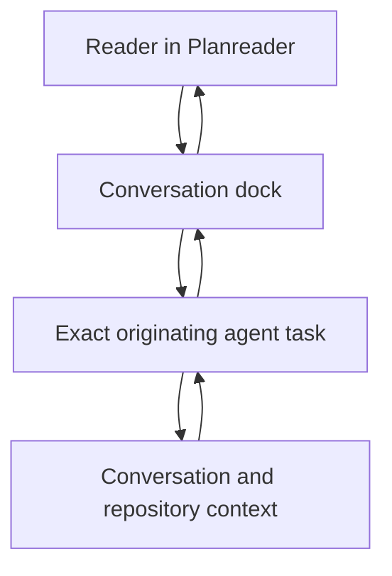
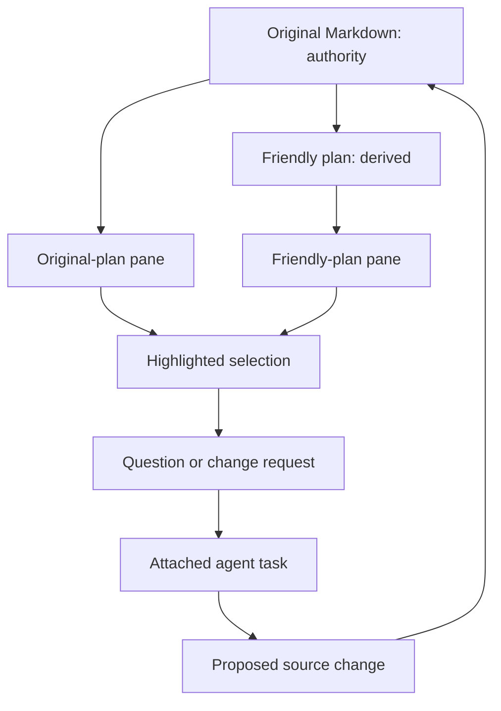
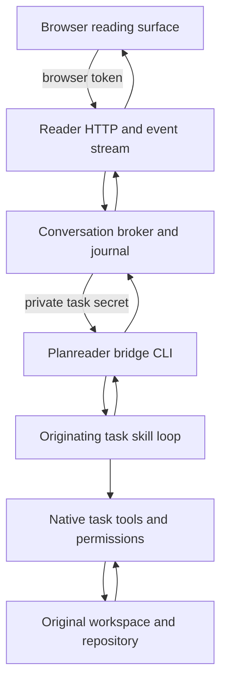
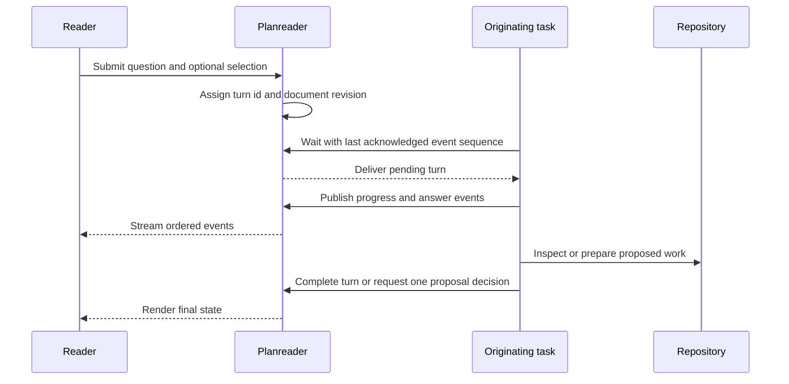
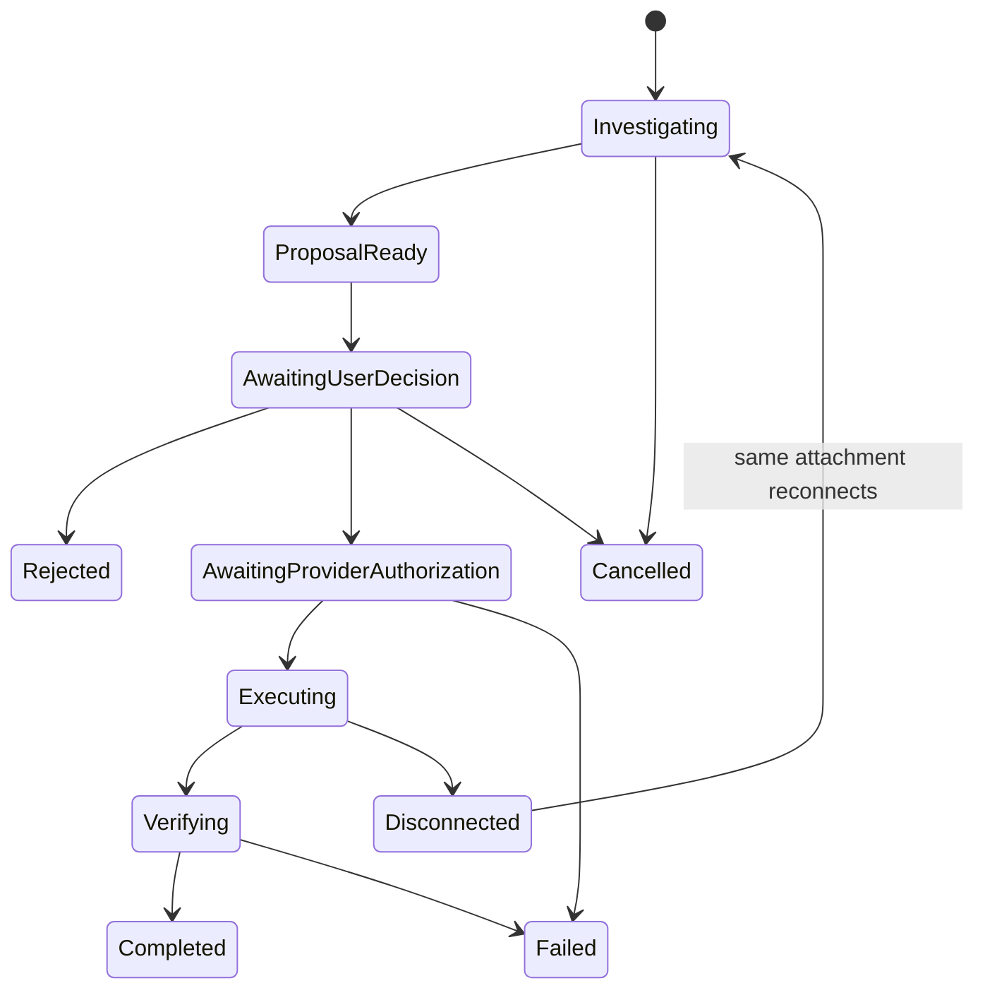
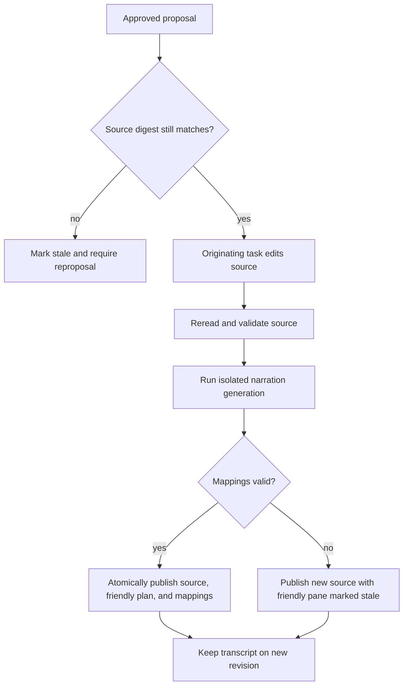

# Attached Agent Conversation - Plan

## Goal Capsule

- **Objective:** Let a user question, investigate, and change a plan from inside Planreader while preserving the full context and capabilities of the Codex or Claude task that opened it.
- **Product authority:** The originating Markdown is the source of truth. Planreader owns the reading and conversation experience; the attached agent task owns reasoning and repository actions.
- **Execution profile:** Deep, cross-provider code work with a provider feasibility gate before the shared implementation proceeds.
- **Stop conditions:** Stop a provider rollout if exact task identity or native authorization cannot cross the bridge without resuming, replacing, or bypassing that provider's task.
- **Tail ownership:** The implementation owner delivers the supported provider matrix, repository verification, browser QA, embedded skill update, and privacy documentation.
- **Open blockers:** None. Provider feasibility is an implementation gate with an explicit unsupported outcome, not an invitation to invent a fallback.

---

## Product Contract

### Summary

Planreader will provide a text-first conversation dock connected to the exact agent task that opened the document.
Users can ask questions or request changes about the whole plan or a highlighted passage in either the original or friendly plan.
The attached task can inspect and change the repository, with progress, proposed effects, and approvals presented inside Planreader.

### Problem Frame

Planreader currently turns a Markdown plan into a private, friendly reading experience, but that experience is one-way.
When a reader encounters an unclear claim or wants a change, they must return to the originating agent interface and rebuild the context of what they were reading.

The friendly plan, original plan, agent conversation, and codebase each contain different parts of the answer.
A disconnected follow-up loses the advantage of the task that already understands all four.

### Key Decisions

- **Use the exact originating task as the agent** `(session-settled: user-approved — chosen over resuming or launching a replacement agent: it preserves live conversation and repository context)`. Governs R1, R2, R3, R4, R5.
- **Give Planreader ownership of the conversation experience** `(session-settled: user-directed — chosen over returning the user to the agent interface: Planreader should remain the companion)`. Governs R6, R7, R8, R9.
- **Allow full agent work** `(session-settled: user-directed — chosen over read-only questions: users should be able to investigate and change the codebase)`. Governs R4, R10, R11.
- **Use a persistent floating conversation dock** `(session-settled: user-approved — chosen over a permanent side workspace or voice-first overlay: it keeps the plan primary while supporting serious chat)`. Governs R6, R7, R8.
- **Keep the original Markdown authoritative** `(session-settled: user-approved — chosen over independently editable friendly content: coordinated regeneration prevents silent drift)`. Governs R12, R13, R14.

The user-facing relationship is:

### Actors

- A1. **Reader:** Reads either representation, asks questions, requests changes, and approves or rejects consequential actions.
- A2. **Planreader:** Presents the document, friendly plan, conversation, agent activity, proposed changes, and connection state.
- A3. **Originating agent task:** Uses its existing conversation and repository access to answer questions and perform approved work.
- A4. **Provider adapter:** Gives Codex and Claude a shared Planreader behavior without exposing provider differences to the reader.

### Requirements

**Session attachment and context**

- R1. Planreader must connect questions to the exact Codex or Claude task that opened the current reader.
- R2. The attached task must retain its existing conversation, working directory, repository access, instructions, and tool capabilities.
- R3. The originating task must remain dedicated to the Planreader connection until the reader closes or disconnects.
- R4. The attached task must support repository investigation and changes rather than limiting the experience to document-only answers.
- R5. Codex and Claude must present the same user-facing conversation states even when their provider-specific capabilities differ.

**Conversation experience**

- R6. Planreader must provide a text-first conversation dock layered over the reading surface without making chat a permanent second pane.
- R7. The dock must normally remain open during an active conversation and let the reader explicitly expand it, close it, or restore it from a compact prompt bar.
- R8. The dock must present questions, streamed answers, agent progress, relevant sources, proposed changes, and completion or failure states in one transcript.
- R9. A lost connection must produce a visible reconnect state and must not silently replace the originating task with a new agent.

**Actions and approvals**

- R10. The reader must be able to approve, reject, or continue discussing a consequential action from inside Planreader.
- R11. A proposed change must remain unapplied until required approval is granted and must show enough effect for the reader to make an informed decision.

**Selection and document authority**

- R12. The reader must be able to highlight text in either the original plan or friendly plan and attach that selection to a question or change request.
- R13. Selection context must identify the selected text, its representation, and its mapping to the authoritative source when one exists.
- R14. The original Markdown must remain the source of truth, and approved source changes must regenerate or reconcile affected friendly-plan content.
- R15. When a proposed change affects both representations, Planreader must show the expected effect on each before approval.
- R16. Friendly-plan content must not silently diverge from the authoritative Markdown.

The source-of-truth relationship is:

### Key Flows

- F1. Open an attached conversation
  - **Trigger:** The originating task opens a Markdown document in Planreader.
  - **Actors:** A1, A2, A3, A4.
  - **Steps:** Planreader opens the reading experience, establishes the attachment, and displays the compact prompt bar or restored conversation dock.
  - **Outcome:** The reader can converse with the same task that opened the plan.
  - **Covered by:** R1, R2, R3, R5, R6.

- F2. Ask a grounded question
  - **Trigger:** The reader submits a question with or without a highlighted passage.
  - **Actors:** A1, A2, A3.
  - **Steps:** Planreader sends the question and selection context to the attached task, displays progress, and streams the grounded answer into the dock.
  - **Outcome:** The reader receives an answer informed by the plan, conversation, and repository.
  - **Covered by:** R4, R7, R8, R12, R13.

- F3. Request and approve a change
  - **Trigger:** The reader asks the attached task to change the plan or repository.
  - **Actors:** A1, A2, A3.
  - **Steps:** The task investigates, presents the proposed effects, pauses when approval is required, and applies or abandons the action based on the reader's decision.
  - **Outcome:** Consequential work happens only after an informed approval.
  - **Covered by:** R8, R10, R11, R15.

- F4. Reconcile the two plan representations
  - **Trigger:** An approved change alters the authoritative Markdown.
  - **Actors:** A2, A3.
  - **Steps:** The source changes, affected friendly content is regenerated or reconciled, and Planreader refreshes both representations without losing the conversation context.
  - **Outcome:** The friendly plan reflects the updated source and does not drift.
  - **Covered by:** R14, R15, R16.

- F5. Recover from a lost attachment
  - **Trigger:** Planreader can no longer reach the originating task.
  - **Actors:** A1, A2, A3, A4.
  - **Steps:** Agent work stops, the transcript remains visible for the reader session, and Planreader offers reconnection to the originating task.
  - **Outcome:** The loss is explicit and no replacement agent acts under false continuity.
  - **Covered by:** R3, R9.

### Acceptance Examples

- AE1. Ask about highlighted original text
  - **Covers R8, R12, R13.**
  - **Given:** The reader highlights a paragraph in the original-plan pane.
  - **When:** They ask whether the implementation already satisfies that paragraph.
  - **Then:** The dock shows the selected passage as context and the attached task answers using the repository and existing conversation.

- AE2. Ask about highlighted friendly text
  - **Covers R12, R13, R14.**
  - **Given:** The reader highlights a simplified explanation in the friendly-plan pane.
  - **When:** They ask for the corresponding original requirement to be clarified.
  - **Then:** The task receives the friendly selection and its source mapping, and its answer distinguishes the derived explanation from the authoritative Markdown.

- AE3. Change both representations
  - **Covers R10, R11, R14, R15, R16.**
  - **Given:** A requested clarification changes the source wording and the corresponding friendly explanation.
  - **When:** The task proposes the update.
  - **Then:** Planreader previews the effects on both representations, waits for approval, updates the source, and reconciles the friendly plan.

- AE4. Keep the conversation available
  - **Covers R6, R7.**
  - **Given:** The reader has an active multi-turn conversation.
  - **When:** They expand, close, and restore the dock.
  - **Then:** The same transcript and active task remain available, while the closed state returns screen space to the plan.

- AE5. Handle disconnection honestly
  - **Covers R3, R9.**
  - **Given:** The originating task ends while Planreader remains open.
  - **When:** The reader submits another question.
  - **Then:** Planreader shows that the task is disconnected, preserves the visible session transcript, and offers reconnection without creating a replacement task.

### Success Criteria

- A reader can move from reading to a context-aware question without leaving Planreader or restating which passage they mean.
- A reader can understand what the agent is doing, what it proposes to change, and when their approval is required.
- Codex and Claude feel like the same Planreader feature rather than two separate integrations.
- Source and friendly content remain traceably aligned after approved plan changes.
- Disconnection never creates the impression that a fresh agent still has the originating task's context.

### Scope Boundaries

**Deferred for later**

- Voice input, spoken conversational turns, and voice-based approvals.
- Continuing the conversation after the originating task has ended.
- Durable transcript persistence beyond the active Planreader session.

**Outside the first version's identity**

- Launching an independent replacement agent owned by Planreader.
- Supporting arbitrary ChatGPT or Claude web conversations that cannot launch and retain a local attached task.
- Allowing friendly-plan edits to diverge independently from the authoritative Markdown.
- Requiring the reader to return to the provider interface for normal conversation or approvals.

### Dependencies and Assumptions

- The originating agent environment can keep a task alive while Planreader is open and can exchange questions, events, answers, and approval decisions with it.
- Both supported providers expose enough structured state to represent progress, requested approvals, completion, errors, and disconnection through a common Planreader experience.
- Friendly-plan passages retain or can recover their mapping to source sections after regeneration.
- Planreader's privacy documentation will distinguish local document handling from information intentionally shared with the already-attached agent task.

### Outstanding Questions

**Deferred to planning**

- What attachment and event transport best preserves one live task for each provider?
- Which provider events can map directly to the common experience, and where does Planreader need a conservative fallback?
- How should an in-progress response or proposed change behave when the dock is closed and restored?
- How can source-to-friendly selection mappings remain stable across approved edits and regeneration?

### Sources and Research

- `skills/read-with-planreader/SKILL.md` defines the current agent-managed launch and lifecycle ownership.
- `cmd/root.go` defines the current provider and reader launch inputs.
- `internal/narration/claude.go` and `internal/narration/codex.go` establish the current one-shot, isolated provider behavior that this feature will extend.
- `internal/reader/server.go` and `internal/reader/lifecycle.go` define the local reader server and current browser-session lifecycle.
- `internal/narration/markdown.go` and `internal/narration/narration.go` define the existing source-section mapping.
- [Claude Code CLI reference](https://docs.anthropic.com/en/docs/claude-code/cli-usage) documents session resume, streaming output, and permission-prompt integration capabilities.

---

## Planning Contract

### Product Contract Preservation

Product Contract unchanged.

### Key Technical Decisions

- KTD1. **Keep the originating task inside a skill-owned bridge loop.** The installed skill will wait for Planreader turns and publish normalized events through Planreader CLI bridge commands instead of starting or resuming a provider session. `(session-settled: user-approved — chosen over session resume or a replacement agent: the exact live task must retain ownership and context)` Governs R1, R2, R3, R4.
- KTD2. **Use a private loopback broker with separate browser and task credentials.** The reader URL token authenticates browser traffic, while a server-side descriptor and distinct high-entropy task secret authenticate the originating task. Governs R1, R5, R9.
- KTD3. **Normalize conversation state in a provider-neutral event journal.** Stable turn, action, and event identifiers plus monotonic sequence numbers provide ordering, idempotency, replay, and reconnect behavior. Governs R5, R7, R8, R9, R10.
- KTD4. **Separate semantic approval from runtime authorization.** Planreader records approval for one immutable proposal, while the provider remains authoritative for sandbox, filesystem, network, and tool permissions. `(session-settled: user-directed — chosen over read-only operation: full agent work must remain subject to the provider's safety model)` Governs R4, R10, R11.
- KTD5. **Keep authoritative document metadata on the server.** The canonical path, source text, content digest, revision, section ranges, and attachment identity never become unrestricted browser data. Governs R12, R13, R14, R15, R16.
- KTD6. **Anchor selections with quote, revision, section, and offsets.** Original selections can resolve to exact source ranges; friendly selections carry exact friendly text plus their broader source-section candidates. Governs R12, R13.
- KTD7. **Apply source changes before regenerating friendly content.** The attached task edits the authoritative file, then Planreader rereads it and uses the existing isolated narration runner to regenerate and atomically publish the derived representation. `(session-settled: user-approved — chosen over independently editing friendly content: the original Markdown remains authoritative)` Governs R14, R15, R16.
- KTD8. **Maintain separate browser and task leases.** Dock presentation never controls execution; browser disappearance, task disconnection, and server lifetime each have explicit recovery or shutdown behavior. Governs R3, R7, R9.
- KTD9. **Support one controller and one active turn in v1.** Additional tabs may observe the shared transcript, but only the elected controller can submit turns or decisions; new submissions remain disabled while a turn is active. Governs R3, R7, R8, R10.
- KTD10. **Treat provider support as a verified capability.** Codex or Claude enters the supported matrix only after the same-task, streaming, authorization, cancellation, and reconnect contract passes end to end; there is no resume fallback. Governs R1, R4, R5, R9, R10.

### High-Level Technical Design

#### Component topology

The browser never receives the task secret, hidden instructions, environment variables, or unrestricted filesystem paths.
The originating task remains the only component that exercises provider tools.

#### Turn and replay sequence

Reconnect resumes from the last acknowledged event sequence.
Duplicate turn IDs, event IDs, and decisions are idempotent.

#### Action authorization state

An approval is bound to an action ID, proposal digest, scope summary, and document revision.
A changed or stale proposal invalidates the approval.

#### Authoritative document refresh

Successful repository work is never rolled back automatically because friendly regeneration failed.

### Implementation Constraints

- Keep `internal/narration/claude.go` and `internal/narration/codex.go` one-shot and isolated; conversation turns must not use them.
- Bind every reader and bridge endpoint to loopback, keep `Cache-Control: no-store`, preserve the restrictive CSP, reject cross-origin mutations, and enforce content-type and body limits.
- Store the task descriptor in a private per-reader directory with owner-only permissions and delete it during normal or crash cleanup.
- Render agent text, progress, references, and diffs as escaped text or restricted Markdown; never insert provider output as trusted HTML.
- Keep transcripts, selections, event journals, and attachment metadata in bounded server memory only for v1.
- Disable attached editing in prepared-document mode unless a verified canonical source path and matching digest are supplied.
- Preserve the existing 2 MB source limit and regular-file checks when rereading after a change.
- Treat plan documents and selected text as untrusted content when they return to the attached task.

### Sequencing

1. Prove the provider contract and freeze the supported matrix before building provider-specific polish.
2. Build the broker and state machines against a deterministic fake task.
3. Add the dock, selection anchors, and lifecycle behavior against the fake task.
4. Add authoritative source update and regeneration behavior.
5. Integrate the first verified provider, then the second through the same contract.
6. Update the installed skill, privacy documentation, and end-to-end verification last.

### System-Wide Impact

- **Agent lifecycle:** Agent-managed mode changes from browser-only cleanup to joint browser and task ownership.
- **Privacy:** Plan questions, selected passages, and relevant source content intentionally return to the attached task; credentials and hidden context remain outside Planreader.
- **Document identity:** The reader becomes revision-aware and mutable in memory while the original file remains authoritative.
- **Provider parity:** User-facing behavior is shared, but unsupported provider capabilities must be shown rather than simulated.
- **Accessibility:** The dock, streaming status, selection context, and approval focus order become part of the reader's keyboard and screen-reader contract.
- **Distribution:** The repo-local skill and the embedded installed copy must stay identical through the existing embed tests.

### Risks and Mitigations

| Risk | Mitigation |
|---|---|
| A host cannot keep the exact task alive across the bridge loop | Make same-task roundtrip the first exit gate and mark that provider unsupported rather than resuming |
| Native authorization cannot be delegated to Planreader | Keep runtime authorization authoritative, surface the blocked state, and require the feasibility gate before claiming full provider support |
| URL-token leakage gains access to powerful actions | Separate browser and task secrets, bind to loopback, validate origin and payloads, and keep proposal approval scoped |
| External edits race with an approved proposal | Compare the current source digest to the proposal base revision before execution |
| Friendly mappings drift after source edits | Replace source, friendly content, and mappings atomically on successful regeneration |
| Regeneration fails after a source edit succeeds | Preserve the source edit, mark friendly content stale, and offer retry |
| Multiple tabs submit conflicting decisions | Elect one controller while allowing other tabs to observe the shared transcript |
| Event replay duplicates work | Deduplicate turn, action, decision, and event identifiers and reject out-of-order state transitions |
| Conversation work expands the existing speech script further | Isolate conversation behavior in a dedicated browser asset and keep speech playback behavior unchanged |

### Sources and Research

- Current launch ownership: `skills/read-with-planreader/SKILL.md`, `cmd/root.go`, `cmd/agent_reader.go`.
- Reader server and lifecycle: `internal/reader/server.go`, `internal/reader/lifecycle.go`.
- Current immutable document and source mappings: `internal/narration/markdown.go`, `internal/narration/narration.go`.
- Current browser integration: `internal/reader/web/index.html`, `internal/reader/web/reader.js`, `internal/reader/web/styles.css`.
- Current provider isolation: `internal/narration/claude.go`, `internal/narration/codex.go`.
- Local Codex app-server schema generation confirms explicit thread, turn, streaming notification, user-input, and approval request surfaces; these are feasibility evidence, not a required Planreader dependency.
- [Claude Code CLI reference](https://docs.anthropic.com/en/docs/claude-code/cli-usage) confirms streaming input/output, session identity, remote control, and permission-prompt hooks; provider integration remains gated by an end-to-end same-task proof.
- No `CONCEPTS.md` or `docs/solutions/` corpus exists, so the implementation cannot rely on prior institutional learnings for this bridge.

---

## Implementation Units

### U1. Prove exact-task attachment for Codex and Claude

**Goal:** Establish which providers can satisfy exact task identity, streaming, runtime authorization, cancellation, and reconnect without starting or resuming another task.

**Requirements:** R1, R2, R3, R4, R5, R9, R10; F1, F2, F3, F5; AE5; KTD1, KTD4, KTD10.

**Dependencies:** None.

**Files:**

- `skills/read-with-planreader/SKILL.md`
- `cmd/bridge.go`
- `cmd/bridge_test.go`
- `internal/agentbridge/probe.go`
- `internal/agentbridge/probe_test.go`
- `README.md`

**Approach:**

1. Add the minimum task wait and event-publish path needed to exercise one browser question against the same launching task.
2. Record task identity, workspace, capability, authorization, cancellation, and reconnect evidence without exposing hidden context to the browser.
3. Produce a Codex/Claude support matrix in `README.md`.
4. Stop provider-specific implementation for any provider that fails KTD10.

**Execution note:** Treat this as a proof gate. Do not preserve experimental provider glue that does not satisfy the final bridge contract.

**Patterns to follow:** Agent-owned process lifecycle in `skills/read-with-planreader/SKILL.md`; loopback validation and cleanup in `cmd/agent_reader.go`.

**Test scenarios:**

1. A browser question wakes the same task that launched Planreader and receives a response containing prior conversation context.
2. The task processes the turn from the original working directory with project instructions and native tools intact.
3. A semantic proposal decision reaches the same task, while a denied provider authorization remains denied.
4. Disconnect and reconnect preserve the attachment identity and do not start or resume another provider process.
5. Cancellation either confirms the task stopped or reports that cancellation could not be confirmed.
6. A provider that fails any gate is absent from the supported matrix and receives no fallback.

**Verification:** Each supported provider has captured same-task evidence for every gate, and unsupported providers fail closed with an honest capability state.

### U2. Add the private conversation broker and bridge protocol

**Goal:** Provide an authenticated, bounded, provider-neutral mailbox and event journal between the reader server and the originating task.

**Requirements:** R1, R3, R5, R8, R9, R10, R11; F1, F2, F3, F5; KTD2, KTD3, KTD4, KTD8, KTD9.

**Dependencies:** U1.

**Files:**

- `internal/agentbridge/types.go`
- `internal/agentbridge/broker.go`
- `internal/agentbridge/broker_test.go`
- `internal/agentbridge/http.go`
- `internal/agentbridge/http_test.go`
- `cmd/bridge.go`
- `cmd/bridge_test.go`
- `internal/reader/server.go`
- `internal/reader/server_test.go`

**Approach:**

1. Define versioned attachment, turn, selection, event, proposal, decision, capability, and lease types.
2. Implement one active turn, one controller, bounded memory, monotonic event sequencing, long-poll task delivery, browser event streaming, cancellation, and replay.
3. Create a private task descriptor and secret separate from the browser URL token.
4. Route conversation APIs through the reader handler rather than speech service.

**Patterns to follow:** Token-scoped loopback handler in `internal/reader/server.go`; mutex-protected lifecycle state in `internal/reader/lifecycle.go`; HTTP method tests using `httptest`.

**Test scenarios:**

1. The correct browser token can submit a turn, while invalid origin, method, content type, or oversized payload is rejected.
2. The correct task secret can wait for one turn and publish ordered events; the browser token cannot access task endpoints.
3. Duplicate turn, event, and decision IDs are idempotent, while sequence gaps and invalid state transitions fail closed.
4. A second submission during an active turn returns a visible busy result without queuing hidden work.
5. Browser replay from an acknowledged cursor returns only unseen events and marks interrupted output after disconnection.
6. An approval decision for an expired, cancelled, changed, or stale proposal is rejected.
7. Agent text and diff content containing HTML are returned as untrusted text.

**Verification:** The deterministic fake task can drive the complete broker contract without a Codex or Claude subprocess.

### U3. Separate browser, task, and server lifecycles

**Goal:** Keep attached work alive or release it according to explicit browser and task leases rather than presentation state.

**Requirements:** R3, R7, R9; F1, F5; AE4, AE5; KTD3, KTD8, KTD9.

**Dependencies:** U2.

**Files:**

- `internal/reader/lifecycle.go`
- `internal/reader/lifecycle_test.go`
- `internal/agentbridge/lease.go`
- `internal/agentbridge/lease_test.go`
- `cmd/root.go`
- `cmd/root_test.go`
- `cmd/agent_reader.go`
- `cmd/agent_reader_test.go`

**Approach:**

1. Preserve browser heartbeat semantics while adding a separate task lease and controller election.
2. Define reload grace, browser-close release, task disconnect, task reconnect, server shutdown, previous-reader replacement, and maximum-lifetime warning behavior.
3. Keep dock compact, open, and expanded states outside lifecycle ownership.
4. Ensure shutdown wakes blocked bridge waiters and deletes private descriptors.

**Patterns to follow:** Existing heartbeat watch loop and shutdown-once behavior in `internal/reader/lifecycle.go`; replacement registry cleanup in `cmd/agent_reader.go`.

**Test scenarios:**

1. Collapsing, closing, or expanding the dock does not alter either lease or cancel an active turn.
2. A browser reload within the grace window preserves the transcript and controller; a second tab is observer-only.
3. Controller release allows an observer to take control without duplicating a turn or approval.
4. Task lease expiry freezes new submissions and exposes same-attachment reconnect.
5. Server shutdown wakes task waiters, expires approvals, and removes the descriptor.
6. Replacing the active agent-managed reader shuts down the old broker without leaking its secret.
7. Maximum lifetime warns before clean termination even when a task is attached.

**Verification:** Lifecycle tests cover every terminal state without conflating browser session IDs with task attachment IDs.

### U4. Make document state revision-aware and selections resolvable

**Goal:** Give questions and proposals stable context across both representations and detect stale source state before changes.

**Requirements:** R12, R13, R14, R15, R16; F2, F4; AE1, AE2, AE3; KTD5, KTD6.

**Dependencies:** U2.

**Files:**

- `internal/narration/markdown.go`
- `internal/narration/markdown_test.go`
- `internal/narration/narration.go`
- `internal/narration/narration_test.go`
- `internal/reader/document.go`
- `internal/reader/document_test.go`
- `internal/reader/server.go`
- `cmd/root.go`
- `cmd/root_test.go`

**Approach:**

1. Retain canonical source identity, content digest, revision, raw source, section ranges, and friendly narration revision in server memory.
2. Extend source rendering with text anchors that survive DOM presentation without exposing the canonical path.
3. Resolve original selections to exact source ranges using quote, section, offsets, and digest.
4. Treat friendly selections as exact friendly anchors with one or more candidate source sections.
5. Gate attached editing in prepared mode unless verified source identity is available.

**Patterns to follow:** Markdown section parsing and source-map validation in `internal/narration`; regular-file and size validation in `cmd/root.go`.

**Test scenarios:**

1. Covers AE1. An original selection resolves to the expected byte and line range for ASCII, Unicode, repeated text, and fenced blocks.
2. Covers AE2. A friendly selection carries its exact sentence or block plus all mapped source candidates and never claims an exact source range without evidence.
3. Cross-section, empty, whitespace-only, oversized, and stale selections are rejected or marked ambiguous.
4. Heading insertion, deletion, and duplicate headings do not silently retarget an existing selection.
5. An external file edit changes the digest and invalidates a pending proposal.
6. Prepared mode remains readable but cannot claim attached edit capability without verified source identity.
7. The browser document payload omits canonical paths, task secrets, and hidden workspace metadata.

**Verification:** Selection tests prove exact source anchoring, honest coarse friendly mapping, and stale-revision detection.

### U5. Build the floating text conversation dock

**Goal:** Add compact, open, and expanded conversation states with streaming, selection context, approvals, reconnect, and accessible controls.

**Requirements:** R6, R7, R8, R9, R10, R11, R12, R13, R15; F2, F3, F5; AE1, AE2, AE4, AE5; KTD3, KTD4, KTD6, KTD8, KTD9.

**Dependencies:** U2, U3, U4.

**Files:**

- `internal/reader/web/index.html`
- `internal/reader/web/styles.css`
- `internal/reader/web/conversation.js`
- `internal/reader/web/reader.js`
- `internal/reader/server_test.go`

**Approach:**

1. Add the compact prompt bar, persistent conversation dock, expanded review state, unread indicator, and explicit close and restore controls.
2. Capture source or friendly selections into removable context chips and preserve the selection payload when the browser selection clears.
3. Render ordered event-journal states, busy and interrupted behavior, proposal effects, semantic decisions, provider authorization blocks, and reconnect results.
4. Keep dock presentation independent from in-flight execution and keep speech playback behavior in `reader.js`.
5. Announce streaming, approval, error, and reconnect states through accessible live regions and predictable focus movement.

**Patterns to follow:** Vanilla DOM helpers and accessibility attributes in `internal/reader/web/reader.js`; responsive pane behavior in `internal/reader/web/styles.css`; embedded-asset assertions in `internal/reader/server_test.go`.

**Test scenarios:**

1. Covers AE4. Closing the dock returns to the compact bar and restoring it preserves the transcript, draft, selection chip, and active turn.
2. Covers AE1 / AE2. Keyboard and pointer selections from either pane produce the correct labeled context chip.
3. Streaming continues while the dock is compact, and unread activity is visible when it is restored.
4. One controller can submit or decide; observer tabs cannot create duplicate work.
5. Approval focus lands on the proposal and returns predictably after approve, reject, or continue discussing.
6. Disconnected, busy, interrupted, stale-selection, stale-proposal, and provider-authorization states each have distinct text and screen-reader output.
7. Narrow viewports preserve access to both plan panes and every conversation action.
8. Agent-supplied HTML, scripts, and hostile Markdown render inertly.

**Verification:** Server asset tests pass and an in-app browser QA pass exercises selection, streaming, dock states, approvals, reconnect, accessibility, and narrow layout.

### U6. Apply authoritative source changes and regenerate the friendly plan

**Goal:** Safely update the original Markdown through the attached task and publish a reconciled friendly plan without losing the transcript.

**Requirements:** R10, R11, R14, R15, R16; F3, F4; AE3; KTD4, KTD5, KTD7.

**Dependencies:** U2, U4, U5.

**Files:**

- `internal/reader/document.go`
- `internal/reader/document_test.go`
- `internal/reader/server.go`
- `internal/reader/server_test.go`
- `cmd/root.go`
- `cmd/root_test.go`
- `internal/narration/narration.go`
- `internal/narration/narration_test.go`

**Approach:**

1. Require each plan proposal to carry its base source digest, source diff, affected scope, and described friendly effect.
2. Revalidate the source immediately before the originating task applies the approved edit through native tools.
3. Reread the changed source with the existing file safety limits, regenerate narration through the existing isolated runner, validate mappings, and atomically refresh both panes.
4. Preserve the transcript and bind answers, proposals, and selections to their originating revision.
5. Keep the new source visible and mark friendly content stale when regeneration fails; allow a retry without replaying the source edit.
6. Avoid narration regeneration for repository changes that do not alter the authoritative plan.

**Execution note:** Start with source-conflict and regeneration-failure tests before enabling any browser approval path that can change the plan.

**Patterns to follow:** Initial narration generation and mapping validation in `cmd/root.go`; immutable document rendering in `internal/reader/server.go`, replaced by a synchronized revisioned document store.

**Test scenarios:**

1. Covers AE3. A current proposal is approved, the source changes once, narration regenerates, mappings validate, and both panes swap to the new revision together.
2. Rejection and continue-discussing decisions produce no source change.
3. An external source edit before execution invalidates approval and requires a new proposal.
4. A changed proposal digest invalidates the prior approval.
5. Source edit success plus narration failure preserves the source revision, marks friendly content stale, and allows narration-only retry.
6. Invalid regenerated mappings keep the prior friendly revision and expose the failure.
7. A non-plan repository edit completes without narration regeneration.
8. Source deletion, replacement with a non-regular file, or growth beyond the size limit fails without applying a stale proposal.

**Verification:** Integration tests prove optimistic concurrency, single application, atomic refresh, and the stale-friendly recovery path.

### U7. Integrate supported providers through the shared contract

**Goal:** Deliver Codex and Claude parity for every capability that passed U1 without leaking provider behavior into the reader UI.

**Requirements:** R1, R2, R4, R5, R8, R9, R10, R11; F1, F2, F3, F5; AE5; KTD1, KTD3, KTD4, KTD10.

**Dependencies:** U1, U2, U3, U5, U6.

**Files:**

- `skills/read-with-planreader/SKILL.md`
- `skills/embed.go`
- `skills/embed_test.go`
- `cmd/bridge.go`
- `cmd/bridge_test.go`
- `internal/agentbridge/types.go`
- `internal/agentbridge/broker_test.go`
- `README.md`

**Approach:**

1. Express the common wait, question, progress, proposal, decision, completion, cancellation, and cleanup loop in the installed skill.
2. Keep provider-specific translation at the skill boundary and normalize every browser-facing event through KTD3.
3. Handshake effective capabilities and show provider limitations rather than inventing parity.
4. Route native authorization according to the verified U1 path and fail closed when the provider cannot continue.
5. Keep the repo-local and embedded skill copies identical.

**Patterns to follow:** Provider selection and launch instructions already present in `skills/read-with-planreader/SKILL.md`; embedded skill parity checks in `skills/embed_test.go`.

**Test scenarios:**

1. Each supported provider passes the same deterministic bridge contract for questions, progress, answers, proposals, decisions, cancellation, and disconnect.
2. Each supported provider proves prior conversation context, workspace, project instructions, and native permissions remain intact.
3. A provider-native denial is surfaced as a denial and never converted into success by Planreader approval.
4. Unknown provider events become conservative status messages and cannot trigger action or approval transitions.
5. Reconnect requires the same attachment identity and secret and never relabels a new task.
6. Embedded skill content matches the repo-local source after the conversation loop is added.

**Verification:** Provider-gated end-to-end evidence matches the support matrix, and unsupported capabilities are visible in the dock and documentation.

### U8. Finish privacy, compatibility, and browser verification

**Goal:** Align the public contract, prepared-mode behavior, installation path, and end-to-end UX with the shipped attached-agent feature.

**Requirements:** R5, R6, R7, R8, R9, R12, R13, R14, R15, R16; all flows and acceptance examples.

**Dependencies:** U1 through U7.

**Files:**

- `README.md`
- `INSTALL.md`
- `skills/read-with-planreader/SKILL.md`
- `skills/embed_test.go`
- `cmd/root_test.go`
- `internal/reader/server_test.go`

**Approach:**

1. Document intentional data flow back to the already-attached task, repository action capability, in-memory transcript retention, prepared-mode limitations, and the provider support matrix.
2. Verify installation and update workflows continue to distribute the embedded skill.
3. Exercise the complete reader experience in a real browser, including narrow layout and screen-reader announcements.
4. Confirm legacy read-only narration still works when no attachment is requested.

**Patterns to follow:** Privacy boundary in `README.md`; guided installation and embedded-skill conventions in `INSTALL.md`, `cmd/install.go`, and `skills/embed_test.go`.

**Test scenarios:**

1. Legacy non-attached launch still creates and reads a private narration without conversation endpoints.
2. Attached launch advertises the provider's verified capabilities and documents intentional context sharing.
3. Prepared mode explains why questions or changes are unavailable when source identity is unverified.
4. Install and update paths contain the new skill loop and do not leave an older embedded copy.
5. Browser QA covers source and friendly selection, question streaming, dock compact/open/expanded states, semantic approval, provider authorization, revision refresh, stale-friendly recovery, reconnect, and shutdown.
6. Privacy checks confirm the browser never receives task secrets, hidden instructions, environment variables, or unrestricted paths.

**Verification:** Documentation matches observed behavior, browser QA is recorded, and the legacy reader path remains intact.

---

## Verification Contract

| Gate | Applies to | Required evidence |
|---|---|---|
| Focused Go tests | Each U-ID | Unit and `httptest` coverage named in the unit passes with vendored dependencies |
| Full Go test suite | U2-U8 and final | `go test -mod=vendor ./...` passes |
| Static analysis | Final | `go vet -mod=vendor ./...` passes |
| Build | Final | `go build -mod=vendor ./...` passes |
| Fake-task contract | U2-U6 | Deterministic end-to-end bridge tests cover replay, approvals, disconnects, concurrency, and regeneration |
| Provider feasibility | U1 and U7 | Same-task identity, prior context, workspace, authorization, cancellation, and reconnect evidence exists for each supported provider |
| Browser QA | U5, U6, U8 | Real-browser evidence covers both selections, all dock states, streaming, approvals, revision refresh, errors, accessibility, and narrow layout |
| Security and privacy review | U2, U4-U8 | Secret separation, loopback binding, origin and size validation, escaping, stale approval rejection, and no browser credential leakage are verified |
| Skill distribution | U7-U8 | `skills/embed_test.go` proves the installed skill matches the repo source |

Provider-gated tests may skip only when that provider is not installed or authenticated.
A skipped provider is not listed as supported.

---

## Definition of Done

- The artifact remains consistent with every Product Contract requirement, flow, acceptance example, success criterion, and scope boundary.
- Every supported provider passes U1 and U7 without starting or resuming another task for conversation turns.
- The deterministic fake task proves the full broker, lifecycle, selection, approval, replay, and document-refresh contract.
- Planreader approval never bypasses provider authorization, and stale or duplicate decisions cannot execute work.
- Original and friendly selections carry honest, revision-aware context.
- Approved plan edits are digest-gated, applied once, and followed by validated regeneration or a visible stale-friendly state.
- Closing or expanding the dock never changes task ownership or cancels in-flight work.
- Browser, task, and server disconnect paths preserve identity and fail without substitution.
- Documentation accurately describes privacy, retention, prepared mode, and the provider support matrix.
- `go test -mod=vendor ./...`, `go vet -mod=vendor ./...`, and `go build -mod=vendor ./...` pass.
- Real-browser QA passes for desktop and narrow layouts with keyboard and screen-reader behavior checked.
- Repo-local and embedded skill content remain identical.
- Experimental provider glue, dead-end bridge variants, temporary probes, and abandoned code are removed.
- No launch-blocking question remains.
